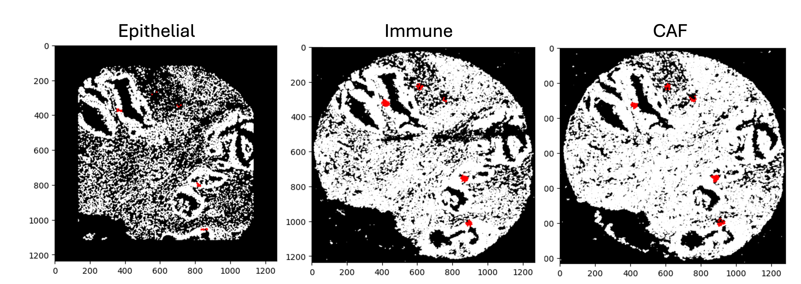

# Serial Section Overlay

This section covers how we aligned single cell masks from separate serial sections. The steps we took were as follows:

Aligning across serial sections:
1. Take only the pan-cytokeratin channel from the multi-stack tiffs, and train epithelial object masks using Ilastik*. The epithelial masks are tiffs where pixels are "1" if the pixel is considered epithelial, and "0" for everything else.
2. Some of our TMAs were acquired in different orientations (ie 180 degree rotation). Cores were matched across slides and rotation was applied as necessary (to both separate files- single-cell masks and object masks). The better the initial match, the better the alignment will work.
3. Sometimes the size of the images for each core was not the same across serial sections, leading to misalignment. For each set of matching images, pad any smaller object masks with pixels set to 0 to match the size of the larger object mask.
4. Load each pair of serial section images, and learn a transformation matrix using StackReg from pystackreg. RIGID_BODY or AFFINE transformations seemed to do an equally good job.
5. Output aligned image pair that is created by the transformation, as a sanity check
6. Assign a unique ID to every object in each of the three object masks, and save a legend of which objects overlap after the transformation is applied. 
7. Assign every cell in each section to the nearest epithelial object in the unaligned object mask. Then use the legend of object overlap between sections to assign every cell has a unique_ep_object_id that tells you which microenvironment it belongs to, across sections. Now we have 1 ID that contains spatially proximal cells from every serial section.

For more granular cross-serial section anaysis:
1. Spatially align the single cell data in the rds/csv files from separate sections by applying the learned transformation to the x/y coordinates of each cell in a given image's csv.
2. Sanity check by visualizing the which cell IDs are within a small radius (21px, euclidean distance) of certain randomly selected pixels across segmented cell masks (pictured above).

Data:

The provided code should run on the three example images provided. 

Citations: 
*Berg, S., Kutra, D., Kroeger, T., Straehle, C. N., Kausler, B. X., Haubold, C., Schiegg, M., Ales, J., Beier, T., Rudy, M., Eren, K., Cervantes, J. I., Xu, B., Beuttenmueller, F., Wolny, A., Zhang, C., Koethe, U., Hamprecht, F. A., & Kreshuk, A. (2019). ilastik: interactive machine learning for (bio)image analysis. Nature Methods, 16(12), 1226–1232.